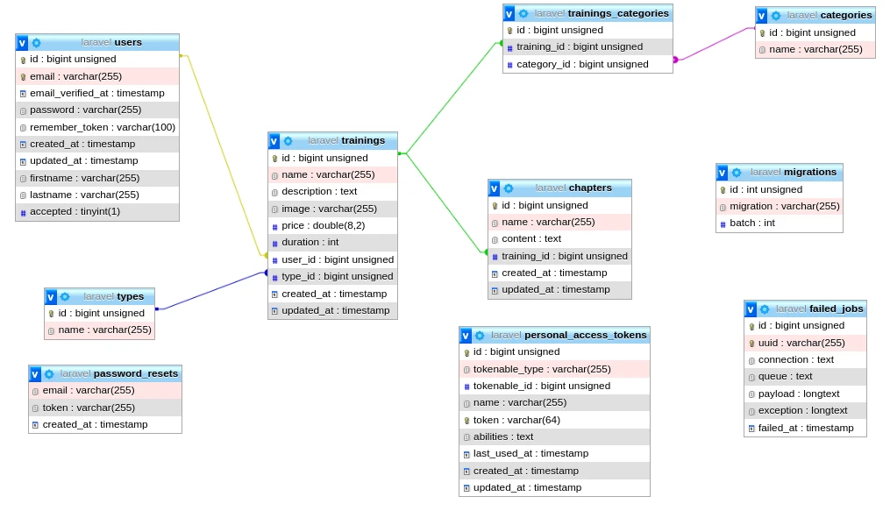

# Projet sigma

## Explication

C'est une plateforme de formations en ligne. On considère 3 types d'utilisateurs : 
- Les visiteurs : ils peuvent consulter les formations.
- Les menbres : ils peuvent créer les formations.
- L'administrateur: il peux tout faire.

## Initialisation du projet

Les commandes à exécuter :
- Installer les dépendances du projet ```composer install```
- Initialiser les variable d'environement du projet ```cp .env.example .env```
- Créer le lien symbolique pour le dossier storage ```php artisan storage:link```
- Initialisation de la base de données ```php artisan migrate```
- Remplir la base de données ```php artisan db:seed```

## MCD

